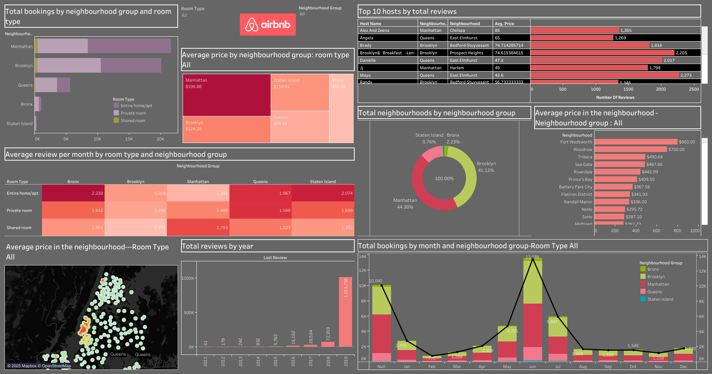

# Airbnb-Analytics-Dashboard-Tableau


##  Project Overview
This project presents an interactive **Airbnb Analytics Dashboard** developed using **Tableau**, focused on analyzing Airbnb listings in **New York City**. The dataset contains various details about Airbnb properties, hosts, reviews, prices, and location-based data. The goal is to uncover key insights and trends that can help stakeholders, such as property managers, travelers, and investors, make data-driven decisions.

---

##  Dataset Description
The Airbnb dataset includes the following fields:
- `id`: Unique identifier for each listing
- `name`: Name of the listing
- `host_id` and `host_name`: Information about the host
- `neighbourhood_group` and `neighbourhood`: Geographical categorization
- `latitude` and `longitude`: Geolocation data
- `room_type`: Type of room offered (Entire home/apt, Private room, Shared room)
- `price`: Nightly rate
- `minimum_nights`: Minimum stay requirement
- `number_of_reviews`, `last_review`, `reviews_per_month`: Review data
- `calculated_host_listings_count`: Number of listings per host
- `availability_365`: Days available per year

---

##  Tools & Technologies
- **Tableau** (for visualization and dashboard design)
- **Microsoft Excel** (for data cleaning)
- **Data Preprocessing**: Removing nulls, fixing data types, and filtering noise

---

##  Analytical Approach

  To ensure actionable insights from the Airbnb dataset, we followed a structured analytical approach:

1. **Data Cleaning**: Handled missing values, corrected data types, and removed inconsistencies using Excel.

2. **Data Exploration**: Conducted initial exploratory data analysis to understand trends, distributions, and outliers.

3. **Metric Calculation**: Derived key performance indicators such as total hosts, reviews per month, and average prices.

4. **Visualization**: Built dynamic Tableau dashboards with filtering capabilities for comparative insights.

5. **Insight Extraction**: Interpreted visual outputs to generate business-focused conclusions for decision-making.

---

##  Key Analyses Performed
We created multiple visual reports and KPIs to analyze and interpret the dataset effectively:

1. **Average Price by Neighbourhood (Filtered by Room Type)**
2. **Total Bookings by Month and Neighbourhood Group (Filtered by Room Type)**
3. **Total Neighbourhoods by Neighbourhood Group**
4. **Top 10 Hosts by Total Reviews**
5. **Total Bookings by Room Type and Neighbourhood Group**
6. **Total Reviews by Year**
7. **Average Price by Neighbourhood Group (Filtered by Room Type)**
8. **Average Price by Neighbourhood (Filtered by Neighbourhood Group)**
9. **Average Reviews per Month by Room Type and Neighbourhood Group**
10. **Calculated Metrics**:
    - Total Hosts
    - Total Neighbourhoods in NYC
    - Average Reviews per Month
    - Total Reviews

---

##  Key Insights
- Identified high-demand neighbourhoods with premium pricing opportunities.
- Noted that **Entire Home/Apt** listings have higher average prices compared to shared spaces.
- **Manhattan** consistently showed the highest listing prices and booking volumes.
- Seasonal patterns observed in reviews and bookings with peaks in summer months.
- Top hosts manage multiple listings and have the highest number of reviews, indicating high trust and activity.

---

##  Dashboard Preview



---

##  Learning Outcomes
- Improved proficiency in data visualization and storytelling using Tableau.
- Developed stronger skills in data cleaning and transformation.
- Gained deeper insights into Airbnb trends, host behaviors, and customer preferences.

---

##  File Structure
```
/airbnb-analytics-dashboard
│
├── data/
│   └── airbnb_nyc_data.csv
├── dashboard/
│   └── airbnb_dashboard.twbx
├── images/
│   └── dashboard-preview.png
├── README.md

```

---

##  How to Access Dashboard
To view the interactive Tableau dashboard:
1. Download the `.twbx` file from the `/dashboard` folder.
2. Open it using Tableau Desktop or Tableau Public.
3. Interact with filters to explore pricing, booking trends, and reviews.

---

##  Conclusion
This Airbnb analytics dashboard helps identify patterns in bookings, host performance, and pricing strategies across New York City. It provides valuable insights to help optimize listings, target profitable neighbourhoods, and improve customer satisfaction.

---


